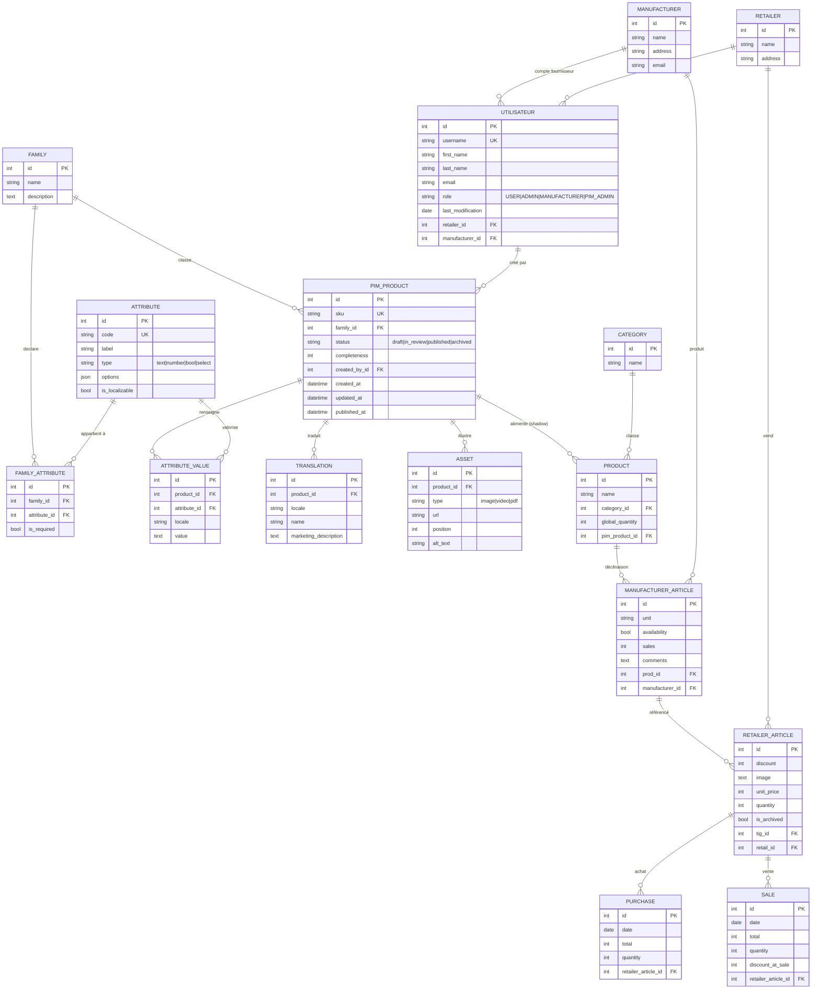

# MCD — FreshPilot + FreshPIM

Modèle conceptuel de données complet : back-office FreshPilot (existant, corrigé) + nouveau référentiel FreshPIM.

## Corrections appliquées au MCD initial

1. **Utilisateur** : ajout de la FK `manufacturer` (un compte fournisseur est rattaché à son entité Manufacturer) + extension de `role` (USER, ADMIN, MANUFACTURER, PIM_ADMIN).
2. **Manufacturer** : ajout du champ `email` (pour identifier le contact fournisseur qui se connectera).
3. **Product** : ajout de la FK `pim_product` (lien shadow-table vers le PIMProduct master).
4. Tout le bloc de gauche (Family, Attribute, FamilyAttribute, PIMProduct, AttributeValue, Translation, Asset) est nouveau.

## Diagramme Mermaid (entity-relationship)

## Vue Merise (entités + associations avec cardinalités)

Pour redessiner dans Looping / JMerise / Mocodo.

### Entités FreshPIM (nouvelles)

| Entité | Attributs |
|---|---|
| **Family** | `family_id` (PK), `name`, `description` |
| **Attribute** | `attribute_id` (PK), `code`, `label`, `type`, `options`, `is_localizable` |
| **PIMProduct** | `pim_product_id` (PK), `sku`, `status`, `completeness`, `created_at`, `updated_at`, `published_at` |
| **AttributeValue** | `attribute_value_id` (PK), `locale`, `value` |
| **Translation** | `translation_id` (PK), `locale`, `name`, `marketing_description` |
| **Asset** | `asset_id` (PK), `type`, `url`, `position`, `alt_text` |

### Associations FreshPIM

| Association | Cardinalités | Sens |
|---|---|---|
| **Compose** (Family ↔ Attribute) | Family `0,n` — Attribute `0,n` + porte `is_required` | Une famille déclare 0..n attributs, un attribut peut servir 0..n familles. C'est `FamilyAttribute`. |
| **Classe** (Family ↔ PIMProduct) | Family `1,n` — PIMProduct `1,1` | Un produit appartient à exactement 1 famille. |
| **Valorise** (PIMProduct ↔ Attribute) | PIMProduct `0,n` — Attribute `0,n` + porte `locale`, `value` | C'est `AttributeValue`. Une valeur par (produit, attribut, locale). |
| **Traduit** (PIMProduct ↔ Translation) | PIMProduct `1,1` — Translation `0,n` | Un produit a 0..n traductions (FR, EN…), chacune appartient à un seul produit. |
| **Illustre** (PIMProduct ↔ Asset) | PIMProduct `1,1` — Asset `0,n` | Un produit a 0..n médias. |
| **Crée_pim** (Utilisateur ↔ PIMProduct) | Utilisateur `0,n` — PIMProduct `0,1` | Auteur du brouillon (souvent un compte MANUFACTURER). |

### Pont FreshPIM ↔ FreshPilot

| Association | Cardinalités | Sens |
|---|---|---|
| **Alimente** (PIMProduct ↔ Product) | PIMProduct `1,1` — Product `0,n` | Shadow-table : un Product FreshPilot peut référencer 0 ou 1 PIMProduct ; le PIM publie, FreshPilot consomme. |

### Entités FreshPilot (corrigées)

Inchangées sauf :
- **Utilisateur** : ajout `manufacturer_id` (FK nullable) et `role ∈ {USER, ADMIN, MANUFACTURER, PIM_ADMIN}`
- **Manufacturer** : ajout `email`
- **Product** : ajout `pim_product_id` (FK nullable)

### Associations FreshPilot (rappel + ajouts)

| Association | Cardinalités |
|---|---|
| Asso 1 — Produit ↔ ManufacturerArticle | Product `1,n` — ManufacturerArticle `1,1` |
| Asso 2 — ManufacturerArticle ↔ RetailerArticle | MA `0,n` — RA `1,1` |
| Asso 3 — Utilisateur ↔ Retailer | Utilisateur `0,1` — Retailer `0,n` |
| **Travaille_pour** — Utilisateur ↔ Manufacturer *(nouveau)* | Utilisateur `0,1` — Manufacturer `0,n` |
| Asso 4 — RetailerArticle ↔ Purchase | RA `1,1` — Purchase `0,n` |
| Asso 5 — RetailerArticle ↔ Sale | RA `1,1` — Sale `0,n` |
| Appartient — RetailerArticle ↔ Retailer | RA `1,1` — Retailer `0,n` |
| Crée — Manufacturer ↔ ManufacturerArticle | Manufacturer `0,n` — MA `1,1` |
| Asso 8 — Category ↔ Produit | Category `0,n` — Produit `1,1` |
| **Référencé** — PIMProduct ↔ Product *(nouveau)* | PIMProduct `0,n` — Product `0,1` |

## Note sur la règle métier "fiche incomplète"

La règle métier décrite dans la note jaune du MCD initial ("si le distributeur scanne un QR code dont le tig_id n'existe pas, on crée une fiche incomplète que le fournisseur viendra compléter") **est exactement le workflow PIM** : c'est le statut `draft` d'un `PIMProduct` créé sans toutes ses valeurs d'attributs, qu'un compte `ROLE_MANUFACTURER` viendra ensuite enrichir. Cette logique tient toujours et trouve naturellement sa place dans FreshPIM.
